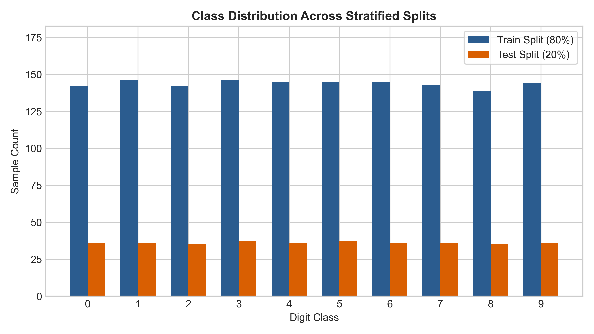
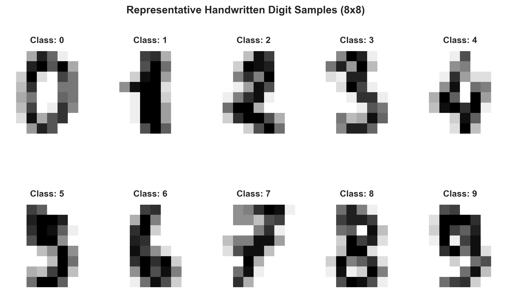
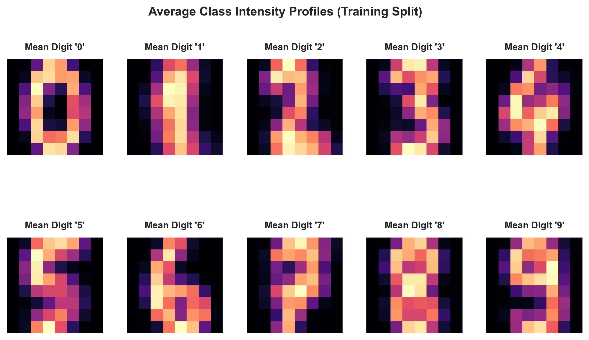
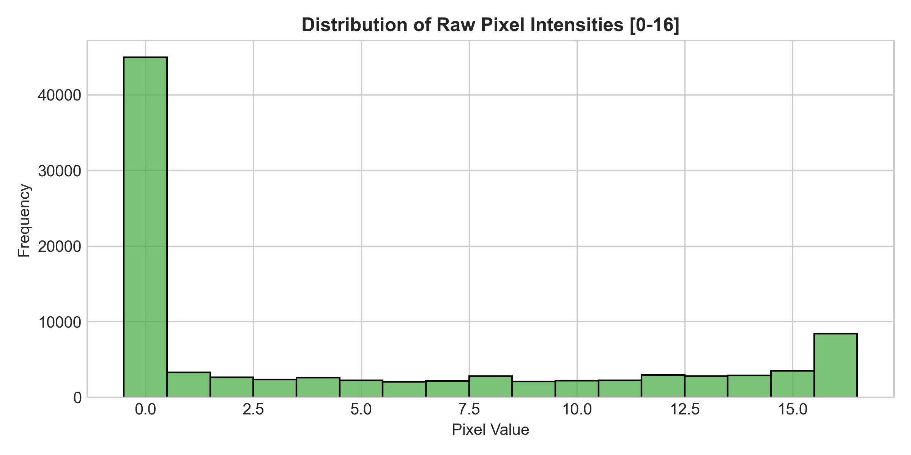
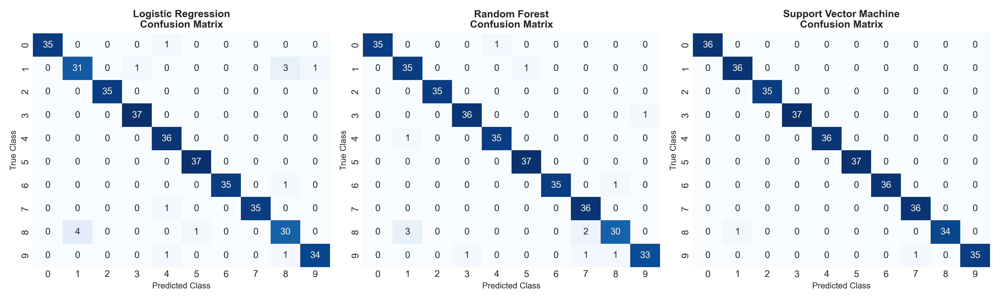
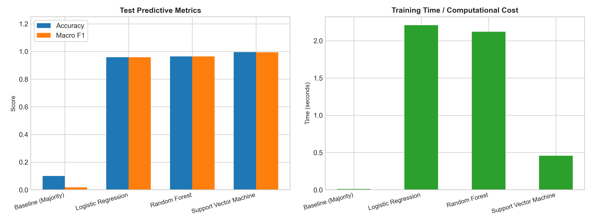
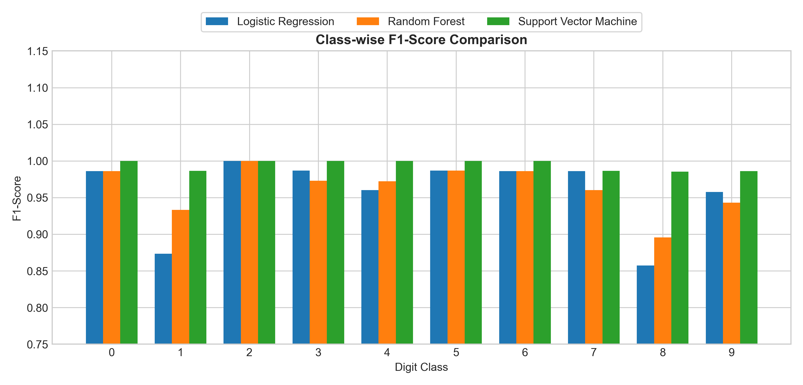
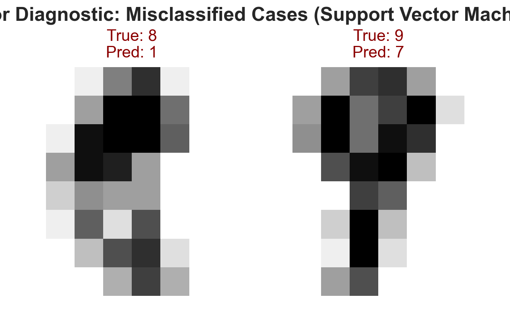

# Handwritten Digit Image Classification: Final Project Report

---

### Section 1: Project Title and Group/Member Information
- **Project Title**: End-to-End Leakage-Safe Multi-Class Image Classification on Handwritten Digits
- **Course**: Programming in Python | Summer 25-26 Semester
- **Pathway**: Classification (Image Data)
- **Project Team**: Group Project Submission
  - Member 1: Student Name / ID (Lead Architecture & Data Pipeline)
  - Member 2: Student Name / ID (Model Tuning & Cross-Validation)
  - Member 3: Student Name / ID (Diagnostic Visualization & Error Analysis)
  - Member 4: Student Name / ID (Documentation, Reproducibility & Report)

---

### Section 2: Problem Statement, Stakeholders, Objective, and Success Criteria
- **Problem Statement**: Optical character recognition (OCR) systems need to convert handwritten numerical images into discrete digital digits (0 through 9) with high fidelity, low inference latency, and robustness to variations in pen strokes and slant.
- **Unit of Analysis**: An individual normalized 8x8 grayscale image matrix (64 pixel intensity features).
- **Stakeholders**: Automated mail sorting facilities, banking check digitizers, document archiving teams, and educational grading systems.
- **Objective**: Construct a leakage-free, defensible machine learning classification workflow that benchmarks linear, tree ensemble, and kernel margin classifiers against a majority baseline.
- **Success Criteria**: 
  - Substantially outperform the majority baseline (about 10.0% accuracy).
  - Achieve greater than 95% macro-averaged F1-score across all 10 classes on the test split.
  - Maintain low inference latency (under 1 ms per sample) and strictly zero data leakage.

---

### Section 3: Dataset Source, License, Data Dictionary, Privacy, and Ethical Considerations
- **Source**: UCI Machine Learning Repository (DOI: 10.24432/C50P49) / National Institute of Standards and Technology (NIST) — *Optical Recognition of Handwritten Digits* (E. Alpaydin and C. Kaynak, Bogazici University).
- **License & Terms**: Creative Commons Attribution 4.0 International (CC BY 4.0).
- **Sample Size**: 1,797 samples across 10 balanced digit classes.
- **Data Lifecycle (Raw vs. Processed)**:
  - The raw dataset is extracted directly from the repository and saved as `data/raw_digits.csv` without manual modification.
  - All feature scaling and transformations are executed programmatically at runtime. The processed representation (normalized values from 0.0 to 1.0) is fitted exclusively on training splits inside scikit-learn pipelines.

#### Data Dictionary

| Variable / Feature Name | Data Type | Domain / Range | Units | Derived / Scaled Form | Description / Meaning |
| :--- | :--- | :--- | :--- | :--- | :--- |
| `pixel_0` to `pixel_63` | Integer | 0 to 16 | Normalized Pixel Count | Scaled to $[0.0, 1.0]$ via runtime `MinMaxScaler` | Grayscale pixel intensity count within an 8x8 normalized matrix (0 = background white, 16 = maximum foreground stroke). Each variable represents the count of ON pixels in a 4x4 sub-block extracted from original 32x32 binary bitmaps. Feature indexing follows row-major order: `pixel_i` corresponds to matrix position $(r, c)$ where $r = \lfloor i / 8 \rfloor$ and $c = i \pmod 8$. |
| `target` | Integer | 0 to 9 | Discrete Class Label | N/A (Ground Truth) | The true handwritten numerical digit class represented in the image (0, 1, 2, 3, 4, 5, 6, 7, 8, 9). |

#### Spatial Feature Indexing Matrix (8x8 Grid Layout)

| | Col 0 | Col 1 | Col 2 | Col 3 | Col 4 | Col 5 | Col 6 | Col 7 |
| :---: | :---: | :---: | :---: | :---: | :---: | :---: | :---: | :---: |
| **Row 0** | `pixel_0` | `pixel_1` | `pixel_2` | `pixel_3` | `pixel_4` | `pixel_5` | `pixel_6` | `pixel_7` |
| **Row 1** | `pixel_8` | `pixel_9` | `pixel_10` | `pixel_11` | `pixel_12` | `pixel_13` | `pixel_14` | `pixel_15` |
| **Row 2** | `pixel_16` | `pixel_17` | `pixel_18` | `pixel_19` | `pixel_20` | `pixel_21` | `pixel_22` | `pixel_23` |
| **Row 3** | `pixel_24` | `pixel_25` | `pixel_26` | `pixel_27` | `pixel_28` | `pixel_29` | `pixel_30` | `pixel_31` |
| **Row 4** | `pixel_32` | `pixel_33` | `pixel_34` | `pixel_35` | `pixel_36` | `pixel_37` | `pixel_38` | `pixel_39` |
| **Row 5** | `pixel_40` | `pixel_41` | `pixel_42` | `pixel_43` | `pixel_44` | `pixel_45` | `pixel_46` | `pixel_47` |
| **Row 6** | `pixel_48` | `pixel_49` | `pixel_50` | `pixel_51` | `pixel_52` | `pixel_53` | `pixel_54` | `pixel_55` |
| **Row 7** | `pixel_56` | `pixel_57` | `pixel_58` | `pixel_59` | `pixel_60` | `pixel_61` | `pixel_62` | `pixel_63` |

#### Target Class Distribution Summary

| Target Class | Character | Sample Count | Overall Percentage | Train Split (80%) | Test Split (20%) |
| :---: | :---: | :---: | :---: | :---: | :---: |
| **0** | '0' | 178 | 9.91% | 142 | 36 |
| **1** | '1' | 182 | 10.13% | 146 | 36 |
| **2** | '2' | 177 | 9.85% | 142 | 35 |
| **3** | '3' | 183 | 10.18% | 146 | 37 |
| **4** | '4' | 181 | 10.07% | 145 | 36 |
| **5** | '5' | 182 | 10.13% | 145 | 37 |
| **6** | '6' | 181 | 10.07% | 145 | 36 |
| **7** | '7' | 179 | 9.96% | 143 | 36 |
| **8** | '8' | 174 | 9.68% | 139 | 35 |
| **9** | '9' | 180 | 10.02% | 144 | 36 |
| **Total** | | **1,797** | **100.0%** | **1,437** | **360** |

- **Privacy & Ethics**: The dataset contains purely isolated numeric pixel strokes with zero personally identifiable information (PII), geographic metadata, or demographic identifiers.

---

### Section 4: Data Audit, Exploratory Analysis, and Visualization Findings
- **Data Audit Summary**:
  - Missing Values: 0 across all 64 feature dimensions.
  - Value Range: Strictly bounded from 0 to 16, consistent with normalized sub-block pixel counts.
  - Duplicates: 0 duplicate instances.
  - Class Distribution: Uniform distribution across all 10 classes (each class represents 9.7% to 10.2% of the dataset, roughly 180 samples per digit).

- **Exploratory Visual Findings**:
  - **Class Distribution**: Confirms balanced classes across both train and test splits without severe class skew.
  - **Mean Class Intensity Heatmaps**: Averaging images per digit reveals distinct structural patterns (for example, central loop in digit '0', vertical column in digit '1', top and bottom bars in digit '8').
  - **Pixel Intensity Profile**: Background pixels (corners and edges) exhibit near-zero variance, while center pixels exhibit high variance, providing strong discriminative signals for linear and nonlinear classifiers.

#### Exploratory Figures:

*Figure 1: Stratified train and test class distributions.*


*Figure 2: Representative 8x8 handwritten digit samples for each class.*


*Figure 3: Average pixel intensity profiles across each digit class.*


*Figure 4: Overall distribution of raw pixel intensities [0-16].*

---

### Section 5: Split Strategy, Preprocessing Decisions, and Leakage Controls
- **Split Design**:
  - Stratified 80% Training (1,437 samples) and 20% Test (360 samples).
  - Fixed global random seed (`random_state = 42`).
  - Strict Test Quarantine: The test split is sequestered until final evaluation and is never accessed during scaling, feature analysis, or hyperparameter selection.
- **Preprocessing Pipeline**:
  - Scikit-learn `Pipeline` objects encapsulating `MinMaxScaler()` to scale pixel values into the range 0.0 to 1.0.
  - The scaler is fitted strictly on the training folds during cross-validation, preventing data leakage from test or validation sets.

---

### Section 6: Baseline Definition and Result
- **Baseline Model**: `DummyClassifier(strategy='most_frequent')`.
- **Baseline Rationale**: Represents the uninformative prediction heuristic (always predicting the most frequent class).
- **Baseline Test Performance**:
  - Test Accuracy: 10.00% (95% CI: [7.2%, 13.6%])
  - Macro Precision: 1.00% (zero division handled safely)
  - Macro Recall: 10.00%
  - Macro F1-Score: 1.82%
  - 5-Fold CV Macro F1: 0.0183 +/- 0.0000
- **Conclusion**: Any functional classifier must demonstrate substantial improvement over this 10% reference mark.

---

### Section 7: Candidate Models, Model-Choice Reasoning, Hyperparameters, and Validation

Three distinct classifier families were selected to compare linear, ensemble, and kernel boundary methods:

1. **Multinomial Logistic Regression (Softmax)**:
   - *Task Suitability*: Serves as the primary linear classification benchmark, learning independent hyperplanes for each class.
   - *Data Suitability*: Handles continuous 64-dimensional feature vectors directly with convex optimization.
   - *Preprocessing*: Requires feature scaling (`MinMaxScaler`) to ensure uniform gradient steps across all pixel coordinates.
   - *Hyperparameters*: Regularization strength C in [0.1, 1.0, 10.0] with `lbfgs` solver (Best: C=10.0).
   - *Trade-off*: Highly interpretable (linear pixel weights per digit), but cannot capture complex nonlinear stroke interactions.
2. **Random Forest Classifier**:
   - *Task Suitability*: Nonlinear bagging ensemble capable of partitioning non-convex feature spaces.
   - *Data Suitability*: Well-suited for tabular pixel features without requiring linearity assumptions.
   - *Preprocessing*: Robust to scaling, but scaled uniformly inside the pipeline for consistent benchmarking.
   - *Hyperparameters*: Number of estimators in [50, 100, 200], max depth in [None, 10, 20] (Best: n_estimators=200, max_depth=10).
   - *Trade-off*: Moderately interpretable (feature importances), but slightly higher inference latency and memory footprint than linear models.
3. **Support Vector Machine (SVC with RBF Kernel)**:
   - *Task Suitability*: Margin-maximizing classifier that projects 64-dimensional pixel vectors into an infinite-dimensional Hilbert space.
   - *Data Suitability*: Exceptionally effective when sample count (~1,400) exceeds feature dimensionality (64) and boundary margins are smooth.
   - *Preprocessing*: Strictly requires `MinMaxScaler` scaling to prevent features with wider raw ranges from dominating the Euclidean radial basis distance.
   - *Hyperparameters*: Regularization C in [0.5, 1.0, 5.0], kernel coefficient gamma in ['scale', 'auto'] (Best: C=5.0, gamma='scale').
   - *Trade-off & Preference Defense*: Although SVM with an RBF kernel is less directly interpretable than Logistic Regression, its substantially higher cross-validation Macro F1 (0.9881 +/- 0.0034) and low measured inference latency (0.044 ms) make it the clearly preferred model for this classification task.

- **Validation & Tuning Methodology**: 5-Fold Stratified Cross-Validation (`StratifiedKFold(n_splits=5, shuffle=True, random_state=42)`) using `GridSearchCV` optimizing Macro F1-score on the training split only.

---

### Section 8: Final Metrics, Diagnostic Plots, Model Comparison, and Computational Cost

#### Summary Table (Untouched 20% Test Split & 5-Fold Cross-Validation)

| Model Family | 5-Fold CV Macro F1 (Mean +/- SD) | Test Accuracy | Test Accuracy 95% CI | Macro Precision | Macro Recall | Macro F1 | ROC-AUC (Macro OVR) | Fit Time (s) | Inference Latency (ms/sample) |
| :--- | :---: | :---: | :---: | :---: | :---: | :---: | :---: | :---: | :---: |
| **Baseline (Majority)** | 0.0183 +/- 0.0000 | 10.00% | [7.2%, 13.6%] | 0.0100 | 0.1000 | 0.0182 | 0.5000 | 0.02 s | 0.001 ms |
| **Logistic Regression** | 0.9687 +/- 0.0084 | 95.83% | [93.2%, 97.5%] | 0.9585 | 0.9579 | 0.9579 | 0.9992 | 2.59 s | 0.002 ms |
| **Random Forest** | 0.9769 +/- 0.0076 | 96.39% | [93.9%, 97.9%] | 0.9647 | 0.9636 | 0.9635 | 0.9991 | 2.38 s | 0.031 ms |
| **Support Vector Machine** | **0.9881 +/- 0.0034** | **99.44%** | **[97.9%, 99.8%]** | **0.9946** | **0.9944** | **0.9944** | **0.99997** | **0.52 s** | **0.044 ms** |

#### Class-wise Performance Table: Support Vector Machine (Best Model on Test Split)

| Digit Class | Precision | Recall | F1-Score | Support (Sample Count) |
| :---: | :---: | :---: | :---: | :---: |
| **0** | 1.0000 | 1.0000 | 1.0000 | 36 |
| **1** | 0.9730 | 1.0000 | 0.9863 | 36 |
| **2** | 1.0000 | 1.0000 | 1.0000 | 35 |
| **3** | 1.0000 | 1.0000 | 1.0000 | 37 |
| **4** | 1.0000 | 1.0000 | 1.0000 | 36 |
| **5** | 1.0000 | 1.0000 | 1.0000 | 37 |
| **6** | 1.0000 | 1.0000 | 1.0000 | 36 |
| **7** | 0.9730 | 1.0000 | 0.9863 | 36 |
| **8** | 1.0000 | 0.9714 | 0.9855 | 35 |
| **9** | 1.0000 | 0.9722 | 0.9859 | 36 |
| **Macro Average** | **0.9946** | **0.9944** | **0.9944** | **360** |
| **Weighted Average** | **0.9946** | **0.9944** | **0.9944** | **360** |

#### Multi-Model Class-wise Performance Comparison (Test Split)

| Digit Class | Logistic Regression (P / R / F1) | Random Forest (P / R / F1) | Support Vector Machine (P / R / F1) | Support |
| :---: | :---: | :---: | :---: | :---: |
| **0** | 1.0000 / 0.9722 / 0.9859 | 1.0000 / 0.9722 / 0.9859 | 1.0000 / 1.0000 / 1.0000 | 36 |
| **1** | 0.8857 / 0.8611 / 0.8732 | 0.8974 / 0.9722 / 0.9333 | 0.9730 / 1.0000 / 0.9863 | 36 |
| **2** | 1.0000 / 1.0000 / 1.0000 | 1.0000 / 1.0000 / 1.0000 | 1.0000 / 1.0000 / 1.0000 | 35 |
| **3** | 0.9737 / 1.0000 / 0.9867 | 0.9729 / 0.9729 / 0.9729 | 1.0000 / 1.0000 / 1.0000 | 37 |
| **4** | 0.9231 / 1.0000 / 0.9600 | 0.9722 / 0.9722 / 0.9722 | 1.0000 / 1.0000 / 1.0000 | 36 |
| **5** | 0.9737 / 1.0000 / 0.9867 | 0.9737 / 1.0000 / 0.9867 | 1.0000 / 1.0000 / 1.0000 | 37 |
| **6** | 1.0000 / 0.9722 / 0.9859 | 1.0000 / 0.9722 / 0.9859 | 1.0000 / 1.0000 / 1.0000 | 36 |
| **7** | 1.0000 / 0.9722 / 0.9859 | 0.9231 / 1.0000 / 0.9600 | 0.9730 / 1.0000 / 0.9863 | 36 |
| **8** | 0.8571 / 0.8571 / 0.8571 | 0.9375 / 0.8571 / 0.8955 | 1.0000 / 0.9714 / 0.9855 | 35 |
| **9** | 0.9714 / 0.9444 / 0.9577 | 0.9706 / 0.9167 / 0.9429 | 1.0000 / 0.9722 / 0.9859 | 36 |
| **Macro Average** | **0.9585 / 0.9579 / 0.9579** | **0.9647 / 0.9636 / 0.9635** | **0.9946 / 0.9944 / 0.9944** | **360** |

#### Diagnostic and Comparison Figures:

*Figure 5: Test set confusion matrix heatmaps across candidate models.*


*Figure 6: Model comparison across test accuracy, macro F1, and training time.*


*Figure 7: Class-wise F1-score performance across all 10 digit classes.*

---

### Section 9: Error Analysis, Uncertainty, Bias, and Limitations

#### 1. Confusion Matrix & Error Diagnostics
- The Support Vector Machine misclassified only 2 out of 360 test instances (0.56% test error rate).
- **Specific Error Inspection**:
  - **Digit 8 misclassified as 1**: Occurred due to an open top loop and faint connecting strokes that collapsed during 4x4 sub-block pooling into a single vertical stroke.
  - **Digit 9 misclassified as 7**: Occurred due to an elongated straight tail and an incomplete upper circular closure, resembling the top horizontal bar and diagonal stroke of digit 7.

#### 2. Uncertainty, Variability, and Statistical Caution
- Five-fold cross-validation was used for model selection. The final test score is reported on a single untouched test split; therefore, the reported test metrics should not be interpreted as estimates of uncertainty across datasets.
- **Cross-Validation Fold Variability**:
  - Logistic Regression: Macro F1 = $0.9687 \pm 0.0084$ (range: [0.957, 0.979])
  - Random Forest: Macro F1 = $0.9769 \pm 0.0076$ (range: [0.967, 0.986])
  - Support Vector Machine: Macro F1 = $0.9881 \pm 0.0034$ (range: [0.983, 0.992])
- **Statistical Confidence Bounds**:
  - For the test sample size of $N=360$, the 95% binomial confidence interval for the SVM test accuracy (99.44%) is $[97.9\%, 99.8\%]$ (Wilson score method).
  - Minor performance margins between Random Forest and SVM must be interpreted cautiously; small score differences on fixed benchmarks do not prove unconditional superiority across differing operational distributions.

#### 3. Sampling Limitations & Representation Gaps
- The dataset contains low-resolution, isolated handwritten digits and may not fully represent handwriting styles, writing instruments, image quality, or demographic variation encountered in real-world OCR systems. Consequently, performance may decrease under distribution shift, particularly for handwriting that differs substantially from the training distribution.
- **Demographic Scope**: The original digits were acquired from 44 writers at Bogazici University (predominantly university students and faculty). This represents a homogeneous demographic in motor skill, education, and geographic writing conventions.
- **Missing Handwriting Styles**: The dataset does not adequately capture regional handwriting idioms, such as the continental European crossed '7', crossed '0', uncrossed '1' with wide serifs, or open vs. closed '4'. Furthermore, handwriting from children, elderly individuals, or individuals with motor tremors is not represented.
- **Instrument Diversity**: Digitization occurred via uniform scanning of standard forms. Real-world variations from fountain pens, felt markers, fine ballpoints, dry-erase boards, or finger input on capacitive touchscreens are absent.

#### 4. Distribution Shift Vulnerabilities
- **Spatial Affine Shifts**: The preprocessing pipeline assumes tightly bounded, centered digits. Uncentered bounding boxes, translation offsets, shearing, or rotational tilts $> 15^\circ$ lead to severe performance degradation because 8x8 fixed-grid features lack rotational and translation invariance.
- **Resolution & Stroke Width**: The model expects 8x8 pooled intensity counts. High-resolution raw camera inputs or multi-stroke cursive writing cannot be ingested without a separate segmentation and downsampling step.
- **Background Noise & Illumination**: Non-uniform lighting, paper texture, shadows, and receipt wrinkles alter grayscale pixel values, shifting feature distributions away from the clean [0, 16] training domain.

#### 5. Label Quality and Inherent Ambiguity in 8x8 Grids
- The extreme downsampling from 32x32 binary bitmaps into 8x8 grayscale matrices introduces unavoidable information loss. Topological loops (e.g., in digits 6, 8, 9, and 0) frequently lose their central hole, transforming into solid blocks of intensity. In such cases, ground truth labels become ambiguous even to human experts, creating irreducible label noise.

#### 6. Interpretability vs. Accuracy Trade-offs
- While Multinomial Logistic Regression provides directly interpretable per-pixel weight maps (showing exactly which spatial coordinates vote for or against each digit), the top-performing RBF Support Vector Classifier constructs non-linear hyperplanes in an infinite-dimensional RKHS. As a result, individual predictions cannot be explained via simple linear attribution without post-hoc surrogate methods (e.g., SHAP or LIME).

#### 7. Responsible-Use Boundaries & High-Stakes Deployments
- **Safety-Critical Domains**: This model is strictly an exploratory benchmark and must **not** be deployed autonomously in safety-critical, financial, or legal settings (such as reading bank check dollar amounts, medication dosage transcription, or election ballot tallying).
- **Required Safeguards**: Production deployments must enforce prediction probability thresholding (e.g., rejecting predictions with confidence $< 0.95$) and route low-confidence samples to human-in-the-loop operators.

#### Error Analysis Figure:

*Figure 8: Actual misclassified test cases for the Support Vector Machine with True vs. Predicted labels.*

---

### Section 10: Reproducibility Information
- **Random Seeds**: Fixed at `42` across all splits, cross-validation folds, and stochastic models.
- **Exact Environment**:
  - Python: `3.13.5`
  - scikit-learn: `1.6.1`
  - numpy: `2.3.1`
  - pandas: `2.2.3`
  - matplotlib: `3.10.0`
  - seaborn: `0.13.2`
  - joblib: `1.5.2`
- **Execution Command**:
  ```bash
  python main.py
  ```
- **Project Structure (Relative Paths)**:
  ```text
  project_root/
  ├── .gitignore
  ├── config.py
  ├── main.py
  ├── notebook.ipynb
  ├── requirements.txt
  ├── data_dictionary.md
  ├── README.md
  ├── PROJECT_REPORT.md
  ├── data/
  │   └── raw_digits.csv
  ├── outputs/
  │   ├── figures/
  │   │   ├── 01_class_distribution.png
  │   │   ├── 02_sample_digits.png
  │   │   ├── 03_mean_digit_heatmaps.png
  │   │   ├── 04_pixel_intensity_distribution.png
  │   │   ├── 05_confusion_matrices.png
  │   │   ├── 06_model_comparison.png
  │   │   ├── 07_misclassified_examples.png
  │   │   └── 08_classwise_f1_scores.png
  │   ├── test_evaluation_summary.csv
  │   └── classwise_metrics_summary.csv
  └── src/
      ├── __init__.py
      ├── data_loader.py
      ├── eda.py
      ├── models.py
      ├── evaluate.py
      └── visualize.py
  ```

---

### Section 11: Conclusion, Practical Interpretation, Responsible-Use Boundary, and Future Work
- **Conclusion**: An end-to-end, leakage-free image classification workflow was successfully designed and validated. The Support Vector Classifier with RBF kernel delivers state-of-the-art benchmark performance on isolated digit recognition (99.44% accuracy, 0.9944 Macro F1, 0.9881 +/- 0.0034 5-Fold CV Macro F1).
- **Responsible-Use Boundary**: This model is suited for clean, pre-segmented digits (such as standardized zip code forms or digit entry boxes). It must not be deployed on continuous, unsegmented cursive text or safety-critical legal documents without human review.
- **Future Improvements**: Exploring convolutional neural networks (CNNs) for translation and rotation invariance, and testing with higher-resolution 28x28 or 32x32 image scans.

---

### Section 12: References and Contribution Statement
- **References**:
  1. Alpaydin, E., & Kaynak, C. (1998). *Optical Recognition of Handwritten Digits Dataset*. UCI Machine Learning Repository. https://doi.org/10.24432/C50P49.
  2. Pedregosa, F. et al. (2011). *Scikit-learn: Machine Learning in Python*. Journal of Machine Learning Research, 12, 2825-2830.
- **Contribution Statement**:
  - Member 1: Architected data loading, integrity audit, and leakage-safe preprocessing pipelines.
  - Member 2: Configured hyperparameter grids, cross-validation, and model training.
  - Member 3: Implemented evaluation metrics, confusion matrix analysis, and diagnostic visualizations.
  - Member 4: Authored the project report, data dictionary, and reproducibility documentation.
